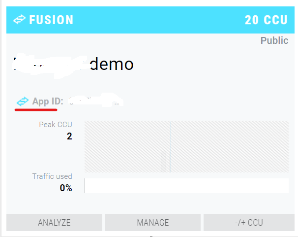
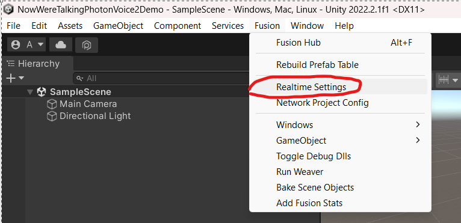
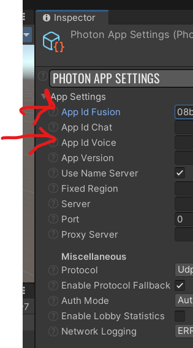

# NowWereTalkingPhotonVoice2Demo

### 1 Create a Photon engine account

[Link](https://id.photonengine.com/account/signup)

### 2 Create a new Fusion application

[Link](https://dashboard.photonengine.com/app/create)

### 3 Get Fusion App Id

[Link](https://dashboard.photonengine.com/)

### 4 Create a new Voice application

Like step 2, but *Select Photon SDK* value should be *VOICE*

### 5 Get Voice App Id

Like step 3

### 6 Setting Fusion and Voice App Ids in Unity

## Launch The Game

Go in the following Path:

\NowWereTalkingPhotonVoice2Demo\Assets\Photon\PhotonVoice\Demos\Fusion\DemoNetworkObject

The main scene is **Scene**.

You need to launch two instances and for each one you should click on **Start Shared Client**

At this point you should see two cube that can talk each other with voice.

## Random informations

